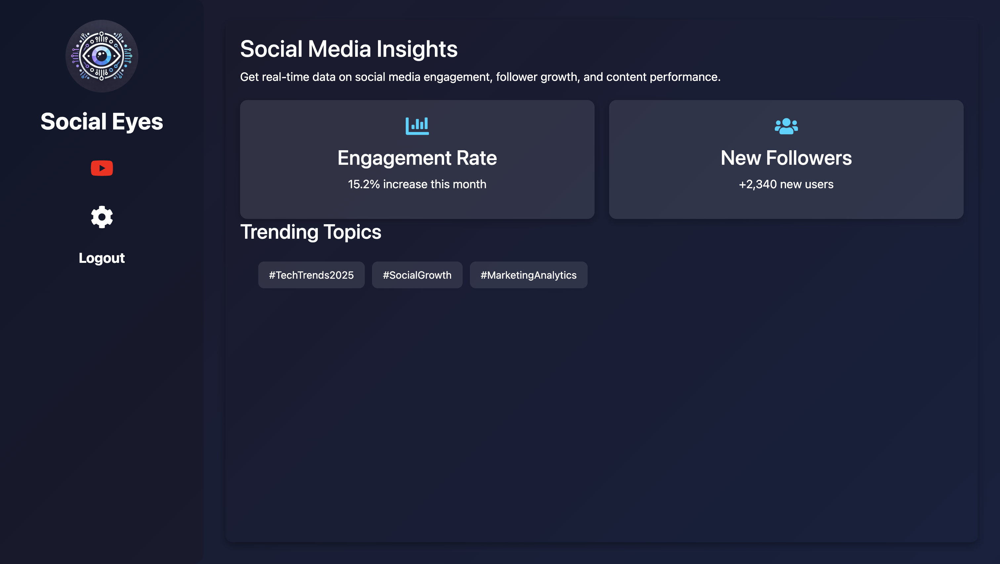
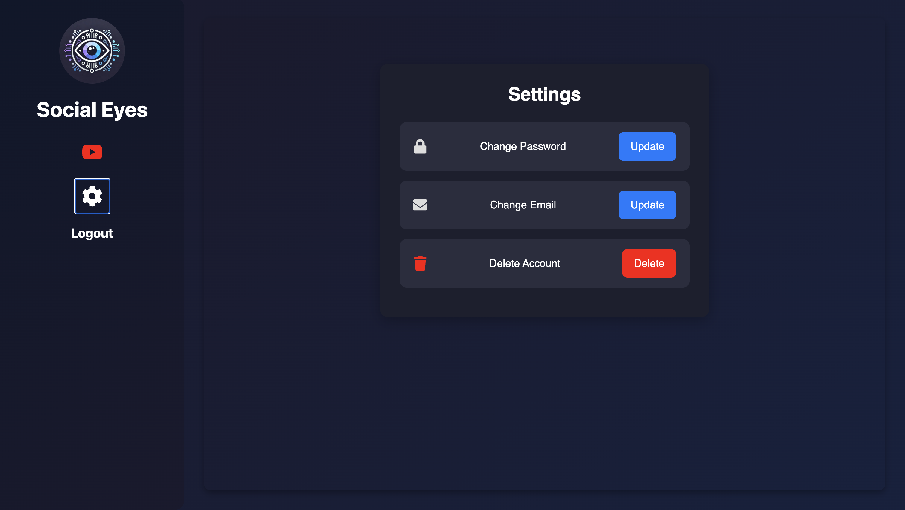
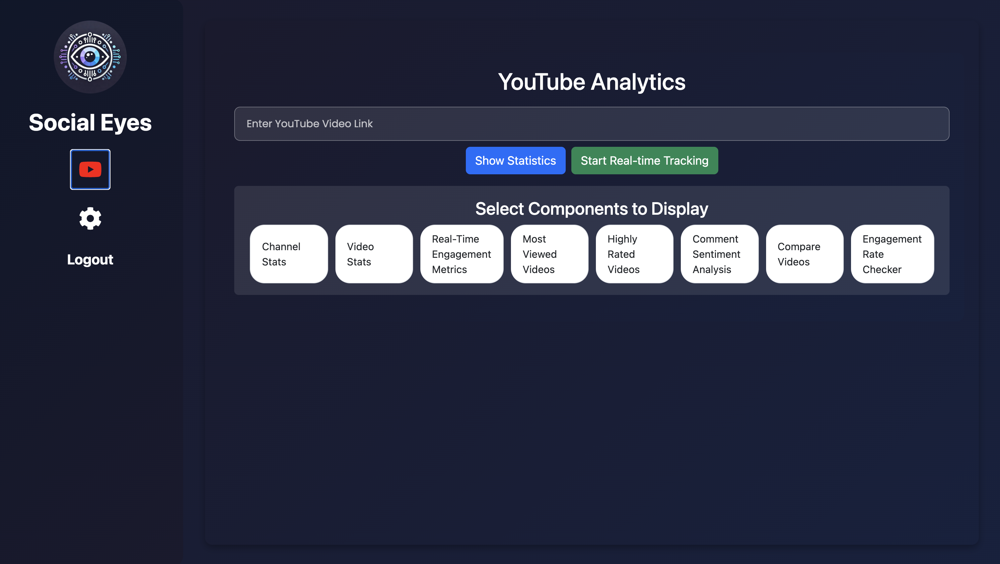

# Social Media Dashboard Application

## Overview

This project provides an interactive platform for users to view and analyze their YouTube videos through a dynamic dashboard. The application allows users to track engagement metrics, analyze video performance, compare timeframes, schedule periodic reports, toggle dark mode, and switch between multiple languages. It provides enhanced flexibilities like multi-device login and supports syncing data from YouTube.

---
### 1. Dashboard

### 2.Login/Signup 

  
  

### 3. Enhanced Flexibilities

  
  

