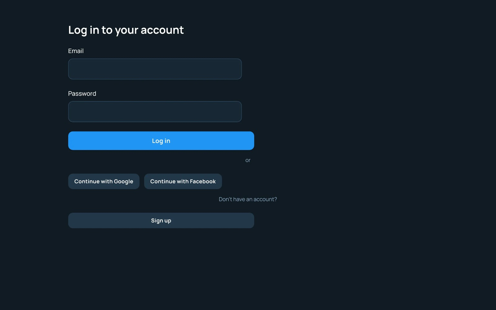
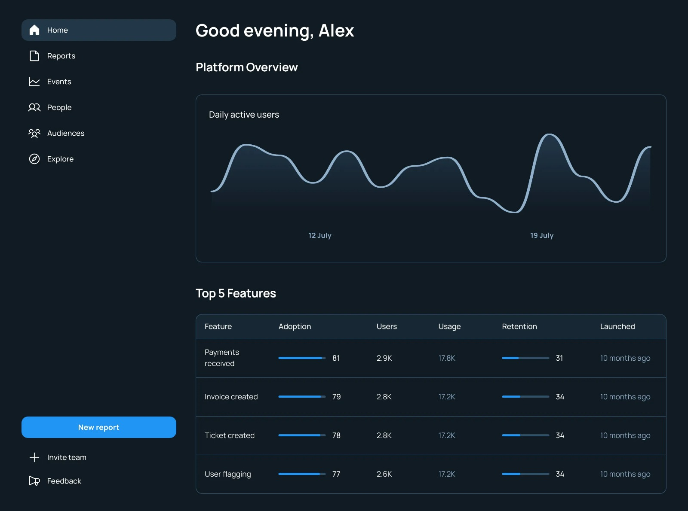
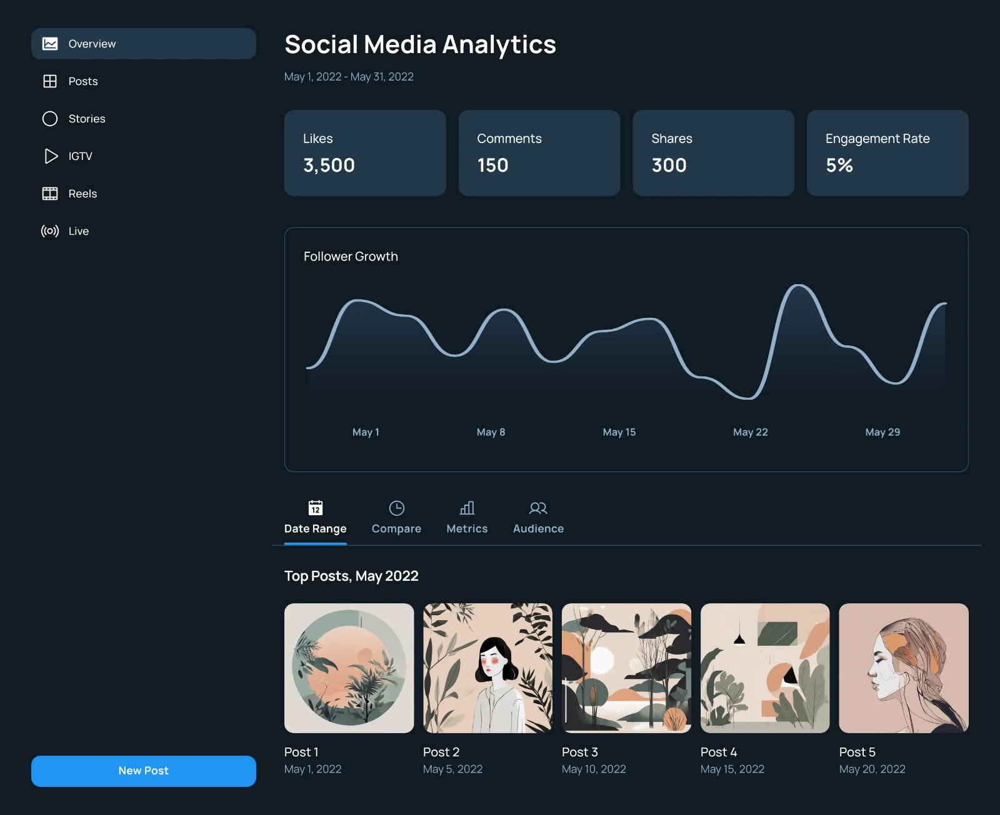

# Social Media Dashboard Application

## Overview

This project provides an interactive platform for users to view and analyze their social media accounts from different platforms (such as Instagram, Twitter, Facebook) through a dynamic dashboard. The application allows users to track engagement metrics, analyze follower growth, compare timeframes, schedule periodic reports, toggle dark mode, and switch between multiple languages. It provides enhanced flexibilities like multi-device login and supports syncing data from social media platforms.

---

## Features
### 1. Login
  
### 2. Dashboard
  
- **Select Social Media Platform**: Choose from available platforms such as Instagram, Twitter, Facebook to view platform-specific statistics.

- **View Platform-Specific Statistics**: Displays metrics such as follower count, engagement rate, and recent activity for the selected platform.

- **Sync Data**: Fetch the latest data from the selected platform and refresh the dashboard for real-time updates.

- **Logout**: Securely log out from the platform to ensure account privacy.

---

### 3. Analytics
  
- **View Engagement Metrics**: Track and view engagement metrics such as likes, comments, shares, and overall engagement rate for the selected platform.

- **Analyze Follower Trends**: Visualize follower growth over time through interactive graphs and detailed data points.

- **Compare Timeframes**: Compare metrics between two different timeframes using tabular or graphical formats.

---

### 4. Enhanced Flexibilities

- **Scheduled Reports**: Schedule periodic reports (daily, weekly, or monthly) in PDF or CSV format, sent to a specified email address.

- **Dark Mode Option**: Toggle between light and dark modes for a better visual experience.

- **Multi-Language Support**: Select and apply preferred languages for the app interface for personalized user experience.

