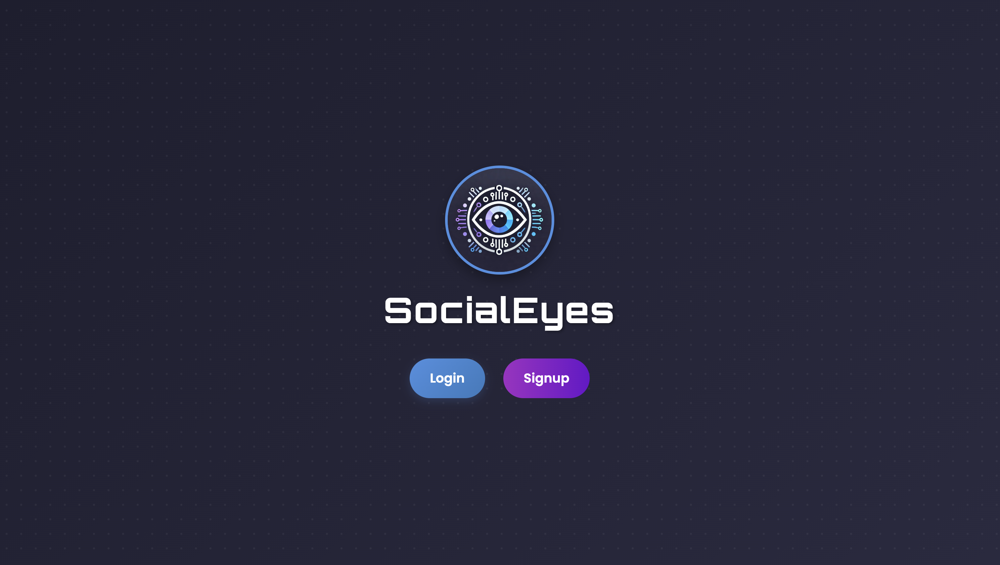
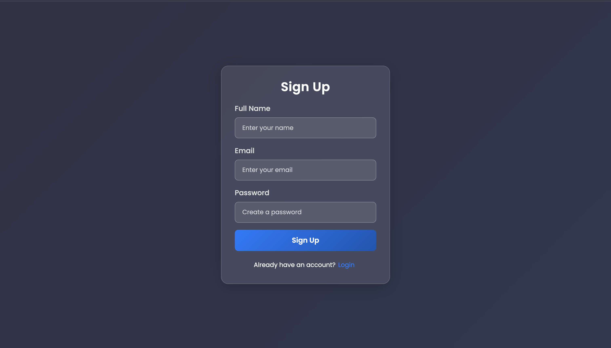

# Social Media Dashboard Application

## Overview

This project provides an interactive platform for users to view and analyze their YouTube videos through a dynamic dashboard. The application allows users to track engagement metrics, analyze video performance, compare timeframes, schedule periodic reports, toggle dark mode, and switch between multiple languages. It provides enhanced flexibilities like multi-device login and supports syncing data from YouTube.

---

## Features
### 1. Login
  
### 2. Dashboard
  
- **Paste YouTube Video Link**: Users can enter a YouTube video link to retrieve analytics and insights.

- **View Video Statistics**: Displays metrics such as views, likes, comments, and watch time for the selected video.

- **Sync Data**: Fetch the latest data from YouTube and refresh the dashboard for real-time updates.

- **Logout**: Securely log out from the platform to ensure account privacy.

---

### 3. Analytics
  
- **View Engagement Metrics**: Track and view engagement metrics such as views, likes, comments, and overall watch time for the selected video.

- **Analyze Video Trends**: Visualize video performance over time through interactive graphs and detailed data points.

- **Compare Timeframes**: Compare metrics between two different timeframes using tabular or graphical formats.

---

### 4. Enhanced Flexibilities

- **Scheduled Reports**: Schedule periodic reports (daily, weekly, or monthly) in PDF or CSV format, sent to a specified email address.

- **Dark Mode Option**: Toggle between light and dark modes for a better visual experience.

- **Multi-Language Support**: Select and apply preferred languages for the app interface for personalized user experience.

