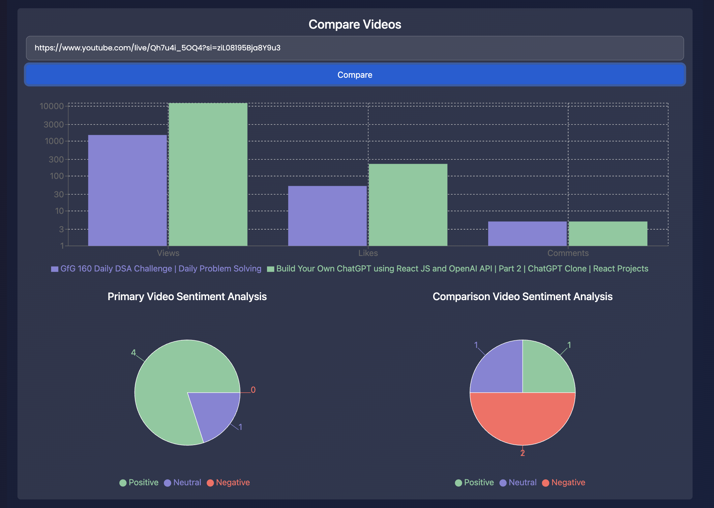
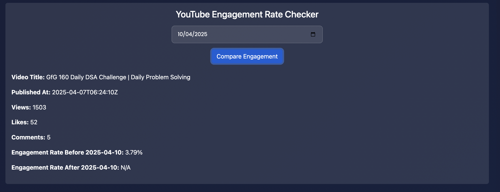

Below is an **enhanced README** that references the newly provided screenshots (located in `src/assets`) and includes a brief folder-structure overview. Feel free to tailor filenames or descriptions to reflect your project precisely.

---

# SOCIALEYES – Social Media Dashboard Application

**SOCIALEYES** is an interactive YouTube analytics platform that empowers content creators to monitor, analyze, and optimize their video performance through a dynamic dashboard. It leverages both the **YouTube Data API** and **YouTube Analytics API** (via Google Cloud) to fetch real-time data. Agile project management is ensured by using **Jira** to track user stories and sprints.

---

## 🚀 Features

- **Comprehensive Dashboard**  
  - **Channel & Video Stats**: Displays essential channel data (subscribers, total videos, total views, upload frequency) and key video metrics (views, likes, comments, duration, trending tags).  
  - **Real-Time Engagement Metrics**: Periodically fetches and displays engagement data (views, likes, comments) over time, creating a historical record.  
  - **Export to CSV**: Allows users to download channel and video statistics, including sentiment analysis data, as a CSV report.

- **Sentiment Analysis & Engagement Checker**  
  - **Comment Sentiment Analysis**: Analyzes user comments using a sentiment analysis library to visualize the sentiment distribution (positive, neutral, negative).  
  - **Engagement Rate Checker**: Compares engagement rates for a specific video before and after a user-specified date.

- **Video Comparison & Similarity Search**  
  - **Compare Videos**: Enables side-by-side comparison of two videos’ key metrics (views, likes, comments) as well as sentiment data.  
  - **Similar Videos (Euclidean Distance)**: Evaluates similarity by normalizing differences in view and like counts.  
  - **Similar Videos (Bregman-Based)**:
    ### 📚 Bergman Ball Trees & Similarity Search

### Purpose of Similarity Searches

SOCIALEYES introduces a feature to find “similar videos” by comparing metrics (views, likes) either via **Euclidean distance** or **Bregman divergence**. These methods identify videos that closely resemble the “main video” in terms of performance and engagement.

### Why Bergman Ball Trees?

A **Bergman Ball Tree** is a specialized data structure engineered to optimize nearest-neighbor searches under **Bregman divergences**. Traditional ball trees work well in Euclidean spaces, but Bregman ball trees cater to non-Euclidean distance metrics. Key benefits include:

- **Optimized Nearest-Neighbor**: Quickly locates the most similar items among a large dataset without exhaustive comparisons.  
- **Scalability**: As the database of videos grows, Bergman ball trees allow SOCIALEYES to maintain speedy response times for similarity queries.  
- **Non-Euclidean Metrics**: Many real-world similarity measures (like Bregman divergences) do not obey traditional Euclidean geometry. Bergman ball trees adapt to these scenarios.

While the full Bergman ball tree implementation may evolve over time, the structured approach allows for robust and efficient recommendation features as your dataset scales.

- **Customizable Interface**  
  - **Component Selection & Drag-and-Drop**: Users can choose which metrics to display and reorder them via drag-and-drop for a personalized dashboard.  
  - **Dark Mode & Multilingual Support**: Improves user experience with theme toggling and multi-language capabilities.  
  - **Multi-Device Login**: Ensures seamless login and usage across various devices.

- **YouTube API Integration**  
  - Uses the **YouTube Data API** and **YouTube Analytics API** from Google Cloud for real-time channel and video insights.

- **Agile Management with Jira**  
  - **Jira** is used to manage user stories and sprints, enabling an iterative development process.

---

## 🖼️ Screenshots

The following screenshots (found in `src/assets`) illustrate various features and pages:

1. **Landing Page**  
   

2. **Signup Page**  
   

3. **Login Page**  
   

4. **Dashboard**  
   

5. **Settings**  
   

6. **Channel Stats**  
   

7. **Video Stats**  
   

8. **Compare Videos**  
   

9. **Comment Sentiment Analysis**  
   

10. **Engagement Rate Checker**  
    

11. **Embedded YouTube Videos**  
    

12. **Most Viewed & Highly Rated Videos**  
    

13. **Similar Videos (Bregman & Euclidean)**  
    

---

## 🛠️ Tech Stack

- **Frontend**: React.js, Vite, Tailwind CSS  
- **Backend**: Node.js, Express.js  
- **APIs**: YouTube Data API, YouTube Analytics API (via Google Cloud)  
- **Authentication**: OAuth 2.0 with Google/YouTube  
- **Visualization**: Recharts (LineChart, BarChart, PieChart, etc.)  
- **Data Processing**: Sentiment (comment sentiment analysis)  
- **Drag-and-Drop**: @hello-pangea/dnd  
- **Testing & Deployment**: Jest, React Testing Library, Jenkins  
- **Project Management**: Jira for tracking user stories and sprints  
- **Version Control**: Git, GitHub  

---

## ⚙️ Installation

1. **Clone the repository**:
   ```bash
   git clone https://github.com/Pavithraa77/SOCIALEYES.git
   ```
2. **Navigate to the project directory**:
   ```bash
   cd SOCIALEYES
   ```
3. **Install dependencies**:
   ```bash
   npm install
   ```
4. **Start the development server**:
   ```bash
   npm run dev
   ```
*Make sure you have [Node.js](https://nodejs.org/) and npm installed on your machine.*

---

## 📦 Deployment

For production or public usage, consider deploying to services like Vercel, Netlify, or Heroku:

1. **Build the application**:
   ```bash
   npm run build
   ```
2. **Deploy the contents of the `dist` folder** to your chosen platform.

Consult the respective platform's documentation for detailed deployment instructions.

---

## 🧪 Running Tests

The project employs **Jest** for automated testing:

- **Run all tests**:
  ```bash
  npm test
  ```
- **Run tests in watch mode**:
  ```bash
  npm test -- --watch
  ```
Ensure your test files are in the correct directories and adhere to naming conventions.

---

